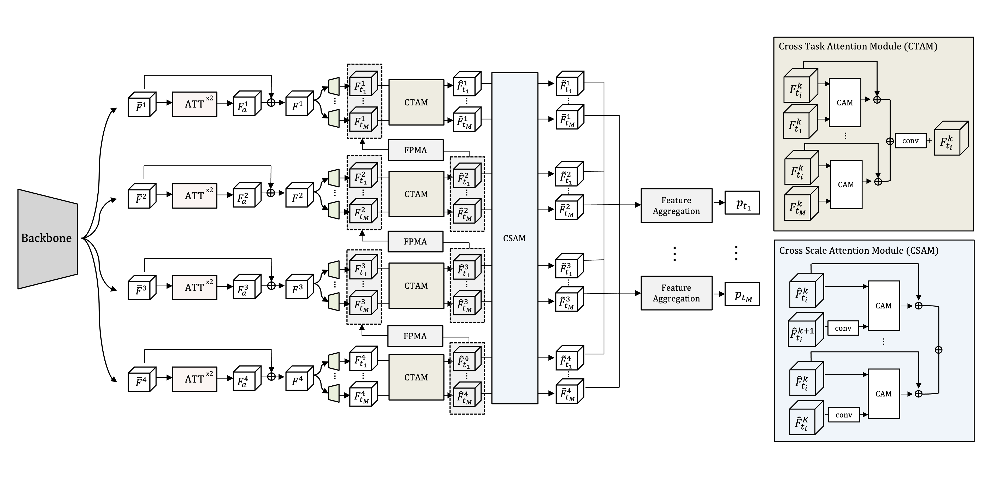

# Sequential Cross Attention Based Multi-task Learning

This repo aims to implement several multi-task learning models and training strategies in PyTorch. The code base complements the following works: 
> [**Sequential Cross Attention Based Multi-task Learning**]()
>
> [Sunkyung Kim](), Hyesong Choi, Dongbo Min.





## Installation
The code runs with recent Pytorch version, e.g. 1.4.
Assuming [Anaconda](https://docs.anaconda.com/anaconda/install/), the most important packages can be installed as:

We refer to the `requirements` file for an overview of the package versions in our own environment.
```shell
conda create -n [your_new_environment_name] --file requirements
```

Install below package

```shell
pip install easydict
pip install timm
```

## Usage

### Setup 
The following files need to be adapted in order to run the code on your own machine:
- Change the file paths to the datasets in `utils/mypath.py`, e.g. `/path/to/nyud/`.
- Specify the output directory in `configs/your_env.yml`. All results will be stored under this directory.
- If you want to use the HRNet backbones, please download the pre-trained weights [here](https://github.com/HRNet/HRNet-Image-Classification). 
The provided config files use an HRNet-18 backbone. Download the `hrnet_w18_small_model_v2.pth` and save it to the directory `./models/pretrained_models/`.

We downloaded the dataset from [MTI-Net](https://github.com/SimonVandenhende/Multi-Task-Learning-PyTorch).
You can download NYUD-v2 dataset [here](https://drive.google.com/file/d/14EAEMXmd3zs2hIMY63UhHPSFPDAkiTzw/view) and Pascal-Context dataset [here](https://data.vision.ee.ethz.ch/kmaninis/share/MTL/PASCAL_MT.tgz)

### Training
The configuration files to train the model can be found in the `configs/` directory. The model can be trained by running the following command:
* You have to train single task learning before training the multi-task learning

```shell
python main.py --config_env configs/env.yml --config_exp configs/$DATASET/hrnet18/$MODEL.yml
```

We evaluate the best model at the end of training. The evaluation criterion is based on Equation 10 from our survey paper and requires to pre-train a set of single-tasking networks beforehand. To speed-up training, it is possible to evaluate the model only during the final 10 epochs by adding the following line to your config file:

```python
eval_final_10_epochs_only: True
``` 

### Evaluation
To evaluate our model on NYUD-v2, you can run:
```shell
python main.py --config_env configs/env.yml --config_exp configs/$DATASET/hrnet18/$MODEL.yml --pretrained_model $folder_name/best_model.pth.tar
``` 
### Pretrained-model
You can download our pretrained_model [here](https://drive.google.com/drive/folders/1Ya3OLxmSAQkn6oBIIdkYb4wI_YEscj45?usp=sharing)


## References
This code repository is heavily based on the [MTINet](https://github.com/SimonVandenhende/Multi-Task-Learning-PyTorch) repository. 


## License
This software is released under a creative commons license which allows for personal and research use only. For a commercial license please contact the authors. You can view a license summary [here](http://creativecommons.org/licenses/by-nc/4.0/).

