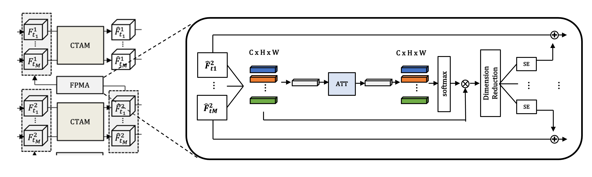

# Feature Propagation Module with Attention (FPMA)

In [MTINet](https://github.com/SimonVandenhende/Multi-Task-Learning-PyTorch), they proposed feature propagation module (FPM).
We introduce the concept of attention to the existing FPM and use it.

FPMA has the same structure as the existing FPM, and the non-linear function has been replaced with an attention module.

## References
This code repository is heavily based on the [MTINet](https://github.com/SimonVandenhende/Multi-Task-Learning-PyTorch) repository. 

## License
This software is released under a creative commons license which allows for personal and research use only. For a commercial license please contact the authors. You can view a license summary [here](http://creativecommons.org/licenses/by-nc/4.0/).

